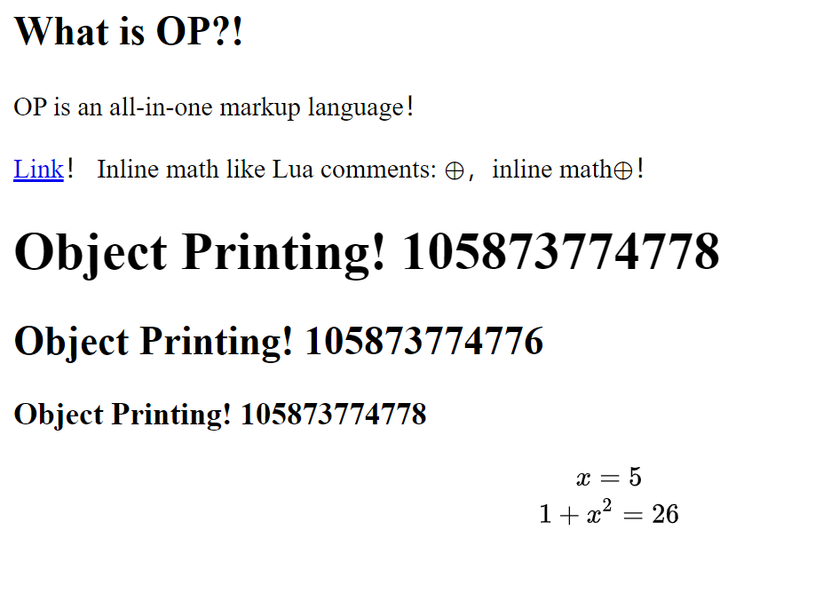

# Original Posting

Markdown is not enough? Integrated MathJax is buggy? Want literate programming? We have ALL IN ONE, and more!

## Usage

1. Installation: `pip install git+https://github.com/thautwarm/original-posting`.
2. Moving files in `./scripts` to your `$HOME/.original-posting/`.
3. Rendering `.op`: `op index.op --out example/ --force [--extra_search_path="./scripts"]`

## Extra Requirements of Commands

0. `wisepy2>=1.3`
1. Markdown support, `@md`: `pip install markdown`
2. Mathjax support, `2math`:
    - `pip install javascript`
    - `nodejs` in PATH with the NPM package `mathjax-node` installed
3. Code highlighting, `@code`: `pip install Pygments`
4. Auto table-of-contents `@toc`: `pip install beautifulsoup4`

**NOTE**: the `math` command is using MathJax, which requires you to install `nodejs` in PATH with `mathjax-node` installed.

P.S: My blog [Site-33](https://github.com/thautwarm/Site-33) is totally written in OP. It's simple and you can learn about how to use OP efficiently.

## Demo
```julia
@begin md
## What is OP?!

OP is an all-in-one markup language！

[Link](https://github.com/mathjax/MathJax-node)！
Inline math like Lua comments: @math|\oplus|，inline math@math||\oplus||！
@begin py
    o = object();p = print
    for i in range(1, 4):
        p("#" * i, "Object Printing!", hash(o))
        o = object()
    x = 5
@end py
@begin math svg
    x = 5 \\
    1 + x^2 = @py|1 + x**2|
@end math

@begin comment
command statement:
    @begin name argument1 argument2...
        block
    @end name
inline command: @name + |||... + code + ...|||
@end comment
@end md
```



## Commands

Under construction but it's damn simple.

A command in OP is a Python file found in `$HOME/.original-posting/`. They are implemented in very short lines, check out `./scripts` for examples!

- `@toc`

    `@toc|--depth 2|` creates table of contents by document hierarchies within depth 2. It only works when placed within a `@md` block.

- `@include`
- `@md`
- `@ptag-set`: set parametric tags for the current document.
- `@ptag-filter-index`: create a list that filters documents whose tags match the given patterns.
- `@math`
- `@plain`: the inner block will not do macroexpand and no escape is required.
- `@comment`
- `@py`
- `@toc`
- `@code`

    - Adding style sheet to the document (not necessary):

        ```julia
        @begin code --mkstyle
        @end
        ```

    - Create a colorful code block:

        ```julia
        @begin code --lang csharp
        public int Add(int a, int b)
        {
            return a + b;
        }
        @end
        ```
